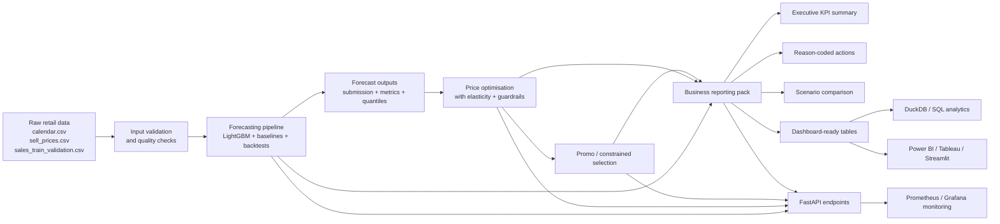

# Retail Decision Intelligence System


A production-minded retail decision intelligence system that connects **demand forecasting**, **price optimisation**, **promo selection**, **business reporting**, **dashboard-ready tables**, and **API / monitoring layers** into one coherent workflow.

This repository is built to show the kind of ownership employers look for in **Data Scientist**, **ML Engineer**, **Applied AI Engineer**, **Decision Scientist**, and **Analytics Engineer** candidates:

* turning raw retail data into a usable decision workflow
* evaluating models against baselines instead of assuming ML always wins
* translating model outputs into actions, review queues, KPI packs, and BI-friendly tables
* packaging the work as an API-backed, tested, monitored, deployment-aware system

---

## What this project is really about

This is **not just a forecasting notebook**.

It is a retail decision-support system that answers a more business-relevant question:

> Given historical sales and price data, what demand should a retailer expect, which price or promo actions look commercially attractive, which actions should be blocked or reviewed, and how should the outcome be reported to decision-makers?

That framing matters because businesses do not buy RMSE. They buy:

* better commercial decisions
* clearer execution visibility
* safer guardrails
* faster analysis
* more honest reporting of what is ready for action versus what still needs review

---

## Why this is stronger than a typical ML portfolio repo

Many portfolio projects stop at:

* feature engineering
* model training
* a metric table
* maybe a dashboard screenshot

This repository goes further by adding:

* **forecast-vs-baseline decisioning**
* **price action generation with guardrails**
* **promo selection under execution constraints**
* **reason-coded recommendations**
* **scenario comparison**
* **executive KPI summaries**
* **dashboard-ready fact and dimension tables**
* **DuckDB analytics loading**
* **FastAPI endpoints**
* **Prometheus / Grafana monitoring**
* **documentation for KPI consumers, not just engineers**

That makes it much closer to a real internal decision-support product.

---

## Business problem

Retailers do not only need demand forecasts. They need a workflow that helps them decide:

* what demand is likely over the next horizon
* whether the forecast model is actually better than a simple baseline
* which items may justify intervention
* whether the proposed uplift is credible enough to trust
* which recommendations should be reviewed rather than auto-executed
* how to compare baseline, unconstrained, and constrained scenarios
* how to hand outputs to BI, commercial, or operations stakeholders

This project solves that problem by connecting data science outputs to a business-facing action layer.

---

## What the system does

### 1) Forecast demand

Builds a forecasting pipeline on M5-style retail data using a production-minded setup with:

* LightGBM-based forecasting
* leak-safe feature generation
* baseline comparison
* last-window and rolling-origin validation
* residual quantiles for uncertainty-style reporting

### 2) Generate price actions

Uses forecast outputs and price / economic assumptions to estimate directional pricing opportunities with:

* elasticity estimation
* fallback elasticity handling
* guardrails on price changes and demand expansion
* suspicious-uplift flags
* commercial summary outputs

### 3) Build a constrained promo / price plan

Moves from "theoretical best action" to "what might be executable under constraints" using:

* total change caps
* optional budget logic
* category / store constraints
* no-forced-execution logic

### 4) Translate outputs into business artefacts

Produces:

* executive KPI summary
* reason-coded recommendations
* scenario comparison tables
* dashboard-ready fact and dimension CSVs
* KPI dictionary
* user guide
* Streamlit dashboard inputs
* DuckDB-friendly reporting outputs

### SQL analytics warehouse case study

The repo includes a local DuckDB analytics warehouse case study for retail decision intelligence. It builds a star schema, finance KPI marts, business-output marts, reusable SQL queries, anomaly outputs, and a Streamlit dashboard that can read DuckDB directly while keeping CSV fallback.

Start here: [docs/sql_analytics_case_study.md](docs/sql_analytics_case_study.md)

Small local build:

```bash
python analytics_sql/build_warehouse.py --data-dir data --reports-dir data/reports --db analytics.duckdb --run-id demo --max-series 100 --start-d d_1 --end-d d_90
```

Finance KPIs in this layer are clearly labelled as proxy metrics because M5 does not provide real COGS, inventory, or audited financial data.

---

## End-to-end architecture



---

## Repository structure

```text
api/                        FastAPI app, schemas, service layer
m5_pipeline/                Forecasting, pricing, promo selection, validation, business outputs
analytics_sql/              DuckDB loader, schema, reusable SQL queries
monitoring/                 Prometheus metrics instrumentation
dashboards/                 Streamlit app + Power BI/Tableau handoff assets
ops/                        Prometheus and Alertmanager config
agents/                     Optional orchestration scaffold
tests/                      API and business-output tests
data/docs/                  KPI dictionary and user guide
data/reports/               Business outputs, scenario comparisons, dashboard-ready tables
scripts_generate_business_pack.py
Dockerfile
docker-compose.yml
README.md
```

---

## Dataset

This project is built around the **M5 forecasting dataset** structure.

Expected core files in `data/`:

* `calendar.csv`
* `sell_prices.csv`
* `sales_train_validation.csv`
* `sample_submission.csv`

This repository tracks the large raw files through DVC metadata. In a fresh clone, run
`dvc pull` before the pipeline, or place files with the exact names above in `data/`.
Local helper copies such as `*_backup.csv` are not read by the pipeline unless renamed.

### GitHub and large data

Do **not** store the full raw dataset directly in GitHub.

Recommended approach:

1. Keep the repository code-first.
2. Create a local `data/` directory.
3. Download the M5 files into `data/`.
4. Run the pipeline locally or in Docker.
5. Store large raw files and heavy generated artefacts outside normal Git, ideally with **DVC + a DVC remote**.

That is the correct professional split:

* **GitHub** for code and lightweight metadata
* **DVC / storage** for large raw data and heavy artefacts
* **Docker** for packaging the runtime

---

## Environment requirements

* Python **3.10**
* A virtual environment is strongly recommended
* On Windows, commands below assume **cmd** unless otherwise stated

### Local setup

```bat
python -m venv .venv
.venv\Scripts\activate
pip install --upgrade pip
pip install -r requirements-dev.txt
copy .env.example .env
```

### Run the API

```bat
uvicorn api.main:app --reload --host 0.0.0.0 --port 8000
```

Open:

* Swagger docs: `http://localhost:8000/docs`
* Health: `http://localhost:8000/health`
* Metrics: `http://localhost:8000/metrics`

---

## Quick validation order

The cleanest way to verify the project is working is:

1. `GET /health`
2. `GET /metrics`
3. `POST /forecast`
4. `POST /price-actions`
5. `POST /promo-selection`
6. `POST /business-pack`
7. `POST /ab-test/simulate`
8. optional: `POST /run-agent-pipeline`

This order matters because downstream endpoints depend on upstream outputs.

For example:

* `/business-pack` expects a usable `price_optimization_results.csv`
* `/promo-selection` expects a usable `price_optimization_results.csv`
* `/price-actions` expects a usable `submission.csv`

So on a clean repo, `/business-pack` should **not** be expected to return `200` before the upstream pipeline steps have run.

---

## API surface

The FastAPI service exposes:

* `GET /health`
* `GET /metrics`
* `POST /forecast`
* `POST /price-actions`
* `POST /promo-selection`
* `POST /business-pack`
* `POST /ab-test/simulate`
* `POST /run-agent-pipeline` *(optional orchestration layer)*

This matters because the project is packaged as a service, not just a notebook.

---

## Exact API payloads and run order

### 1) Forecast demand

Endpoint:

```text
POST /forecast
```

Recommended first payload:

```json
{
  "data_dir": "data",
  "max_series": 50,
  "start_d": "d_1800",
  "last_train_d": "d_1913",
  "horizon": 28,
  "objective": "tweedie",
  "tweedie_variance_power": 1.1,
  "two_stage": true,
  "split_strategy": "last_window",
  "n_backtests": 1,
  "backtest_stride": 28,
  "validate_inputs": true,
  "save_artifacts": true
}
```

More realistic heavier run:

```json
{
  "data_dir": "data",
  "max_series": 200,
  "start_d": "d_1500",
  "last_train_d": "d_1913",
  "horizon": 28,
  "objective": "tweedie",
  "tweedie_variance_power": 1.1,
  "two_stage": true,
  "split_strategy": "rolling_origin",
  "n_backtests": 3,
  "backtest_stride": 28,
  "validate_inputs": true,
  "save_artifacts": true
}
```

Main outputs:

* `data/submission.csv`
* `data/artifacts/forecast/<run_id>/...`
* forecast metrics and residual quantile artefacts

Business meaning:

* compare the model against baselines
* do **not** assume the model should serve just because it is ML
* if baseline wins, report that baseline is the safer serving choice

---

### 2) Generate price actions

Endpoint:

```text
POST /price-actions
```

Payload:

```json
{
  "data_dir": "data",
  "submission_path": "submission.csv",
  "last_train_d": "d_1913",
  "margin": 0.3,
  "unit_econ_path": null,
  "max_series": 200,
  "lookback_days": 365,
  "elasticity_clip_low": -5.0,
  "elasticity_clip_high": -0.1,
  "max_abs_price_change_pct": 0.2,
  "max_demand_mult": 3.0,
  "suspicious_profit_gain_pct": 400.0,
  "suspicious_demand_gain_pct": 500.0
}
```

Main outputs:

* `data/price_optimization_results.csv`
* `data/reports/price_actions.csv`
* `data/reports/price_opt_summary.json`

Important path note:

* `submission_path` is interpreted **relative to `data_dir`**
* so when `data_dir` is `"data"`, use `"submission.csv"`, not `"data/submission.csv"`

Business meaning:

* this is the **directional action layer**
* it estimates where price changes may create profit or demand upside
* it is **not** proof of production-ready pricing on its own
* suspicious rows and fallback-evidence rows should be reviewed, not blindly executed

---

### 3) Build constrained promo / execution plan

Endpoint:

```text
POST /promo-selection
```

Payload:

```json
{
  "data_dir": "data",
  "input_path": "price_optimization_results.csv",
  "max_price_changes_total": 5000,
  "max_price_changes_per_store": 800,
  "max_price_changes_per_cat": 1200,
  "budget": null,
  "forbid_price_increase": true,
  "max_abs_price_change_pct": 0.2,
  "max_demand_mult": 3.0,
  "objective": "profit",
  "require_price_change": true,
  "promo_discount_grid": [-0.2, -0.1, -0.05]
}
```

Main outputs:

* `data/promo_selection_results.csv`
* `data/reports/promo_selection_summary.json`

Important path note:

* `input_path` is interpreted **relative to `data_dir`**
* so use `"price_optimization_results.csv"`, not `"data/price_optimization_results.csv"`

Business meaning:

* this converts theoretical opportunities into a constrained execution plan
* promo selection defaults to discount-only real price changes
* `0.0` / no-change candidates are only allowed when `require_price_change` is `false`
* MILP chooses executable promo / price actions under constraints and does not count no-op rows as selected business actions
* if the constrained plan approves no changes, that is useful information
* it means the current opportunity set is not yet strong enough for live execution under the current rules

---

### 4) Generate the business pack

Endpoint:

```text
POST /business-pack
```

Payload:

```json
{
  "data_dir": "data"
}
```

Main outputs:

* `data/reports/executive_kpi_summary.json`
* `data/reports/executive_kpi_summary.md`
* `data/reports/reason_coded_action_recommendations.csv`
* `data/reports/scenario_comparison.csv`
* `data/reports/dashboard_ready/...`
* `data/docs/kpi_dictionary.md`
* `data/docs/user_guide.md`

Important behavior:

* on a clean repo, this may return `400` until `price_optimization_results.csv` exists
* that is expected behaviour, not necessarily a bug

Business meaning:

* this is the layer a commercial, BI, or analytics stakeholder would actually consume
* it converts technical outputs into executive and analyst-facing artefacts

---

### 5) Simulate A/B-style action outcomes

Endpoint:

```text
POST /ab-test/simulate
```

Payload:

```json
{
  "price_actions_csv": "data/price_optimization_results.csv",
  "out_report_json": "data/reports/ab_test_simulation_checked.json",
  "treatment_share": 0.5,
  "noise_sigma": 0.1,
  "elasticity_col": "elasticity",
  "n_boot": 500,
  "seed": 42
}
```

Main outputs:

* `data/reports/ab_test_simulation_checked.json`

Important path note:

* `price_actions_csv` here is used as a **direct path**
* so here `"data/price_optimization_results.csv"` is correct

Business meaning:

* this is a scenario / experimentation support layer
* it helps frame the recommendations in terms of outcome uncertainty rather than only point estimates

---

### 6) Run the optional orchestration agent

Endpoint:

```text
POST /run-agent-pipeline
```

Lighter first payload:

```json
{
  "data_dir": "data",
  "params": {
    "max_series": 20,
    "start_d": "d_1850",
    "last_train_d": "d_1913",
    "horizon": 28,
    "objective": "tweedie",
    "two_stage": true,
    "split_strategy": "last_window",
    "n_backtests": 1,
    "backtest_stride": 28,
    "save_artifacts": true
  }
}
```

More complete payload:

```json
{
  "data_dir": "data",
  "params": {
    "max_series": 50,
    "start_d": "d_1800",
    "last_train_d": "d_1913",
    "horizon": 28,
    "objective": "tweedie",
    "tweedie_variance_power": 1.1,
    "two_stage": true,
    "split_strategy": "last_window",
    "n_backtests": 1,
    "backtest_stride": 28,
    "save_artifacts": true,
    "submission_path": "submission.csv",
    "margin": 0.3,
    "lookback_days": 365,
    "elasticity_clip_low": -5.0,
    "elasticity_clip_high": -0.1,
    "max_abs_price_change_pct": 0.2,
    "max_demand_mult": 3.0,
    "suspicious_profit_gain_pct": 400.0,
    "suspicious_demand_gain_pct": 500.0,
    "input_path": "price_optimization_results.csv",
    "max_price_changes_total": 5000,
    "max_price_changes_per_store": 800,
    "max_price_changes_per_cat": 1200,
    "budget": null,
    "forbid_price_increase": true,
    "promo_objective": "profit",
    "require_price_change": true,
    "promo_discount_grid": [-0.2, -0.1, -0.05],
    "uplift_cutoffs": ["d_1800", "d_1856", "d_1912"]
  }
}
```

What it does:

* validates inputs
* runs forecast
* runs price optimisation
* runs promo selection
* may run uplift-style analysis
* returns a staged summary

Important positioning:

* this is an orchestration wrapper around deterministic business logic
* that is the right form of agentic behavior for this repo
* it is not a free-form autonomous LLM making unbounded commercial decisions

---

## One-command pipeline run

You can also run the full pipeline directly from the command line.

```bat
python -m m5_pipeline.pipeline --data-dir data --max-series 200 --split-strategy last_window --n-backtests 1
```

This is the cleanest end-to-end run path outside Swagger.

Typical outputs refreshed by that run include:

* `data/submission.csv`
* `data/price_optimization_results.csv`
* `data/promo_selection_results.csv`
* `data/reports/...`
* `data/artifacts/forecast/...`

---

## Business pack, dashboard, and SQL layer

### Generate the business pack directly

```bat
python scripts_generate_business_pack.py --data-dir data
```

### Run the Streamlit dashboard

```bat
streamlit run dashboards/streamlit_app.py
```

### Load outputs into DuckDB

```bat
python analytics_sql/load_duckdb.py --db analytics_sql/analytics.duckdb --reports-dir data/reports
```

Example query:

```bat
duckdb analytics_sql/analytics.duckdb -c "SELECT * FROM fact_scenario_comparison;"
```

This layer matters because it shows the work can be consumed in:

* SQL analysis
* Streamlit
* Power BI
* Tableau
* downstream executive reporting

---

## Docker and monitoring

Create the environment file:


copy .env.example .env

```

Run the stack:


docker compose up --build
```

Services:

* FastAPI: `http://localhost:8000`
* Prometheus: `http://localhost:9090`
* Alertmanager: `http://localhost:9093`
* Grafana: `http://localhost:3000`

Recommended workflow:

1. get the repo working locally first
2. move large data out of GitHub, ideally with DVC
3. confirm a fresh clone can recover required data
4. then build and publish Docker

That separation keeps:

* **DVC** focused on large data and artefacts
* **Docker** focused on packaging the runtime

---

## Tests

Run tests with:

```bat
pytest -q
```

Important note for a clean repo:

* a clean repo may not already contain generated outputs like `price_optimization_results.csv`
* so `/business-pack` should not be treated as a guaranteed `200` smoke test unless upstream outputs were generated first

A better test strategy is:

### Smoke tests

* `/health` returns `200`
* `/metrics` returns `200`
* API import and schema checks succeed

### Contract / failure-path tests

* `/business-pack` returns a controlled `400` if required upstream files are missing

### Integration tests

Run the actual chain:

1. `/forecast`
2. `/price-actions`
3. `/promo-selection`
4. `/business-pack`

---

## Business-facing outputs in the updated version

The updated version includes the business layer that makes the project much stronger for recruiter review.

### Executive KPI summary

* `data/reports/executive_kpi_summary.json`
* `data/reports/executive_kpi_summary.md`

### Reason-coded action recommendations

* `data/reports/reason_coded_action_recommendations.csv`

### Scenario comparison

* `data/reports/scenario_comparison.csv`

### Dashboard-ready reporting tables

Under `data/reports/dashboard_ready/`, for example:

* `fact_action_recommendations.csv`
* `fact_scenario_comparison.csv`
* `agg_store_action_summary.csv`
* `agg_category_action_summary.csv`
* `agg_reason_code_mix.csv`
* `fact_uplift_backtest.csv`
* `dim_reason_codes.csv`
* `dim_kpi_dictionary.csv`

### Stakeholder documentation

* `data/docs/kpi_dictionary.md`
* `data/docs/user_guide.md`

---

## Production-thinking signals in this repo

This project is designed to communicate production awareness through:

* input validation before modelling
* baseline comparison instead of blind trust in ML
* backtesting support
* guardrails for pricing and uplift credibility
* reason-coded action outputs instead of opaque recommendations
* review queues when evidence is weak
* FastAPI packaging
* Prometheus metrics
* Grafana / Alertmanager stack
* DuckDB reporting layer
* Streamlit dashboard
* tests for API and business outputs
* KPI dictionary and user guide for business consumers

That combination is what helps the repo feel like a system rather than a coursework submission.

---

## Who this project is for

This project is especially relevant for roles such as:

* Data Scientist
* ML Engineer
* Applied AI Engineer
* Decision Scientist
* Pricing Analyst / Pricing Data Scientist
* Analytics Engineer with ML exposure
* Retail / commercial analytics roles with product thinking

---

## Limitations

A strong README states limitations clearly.

Current limitations of the sample output story may include:

* current pricing recommendations rely heavily on **fallback elasticity**
* the constrained plan approves **zero live price changes** under current rules
* the included sample slice can still be too narrow to support a real commercial rollout narrative

---

## Final positioning

**A production-minded retail decision intelligence portfolio project that connects forecasting, pricing logic, constrained execution thinking, stakeholder reporting, BI handoff, and deployment-aware engineering.**

---

## If you are reviewing this repo as a recruiter or hiring manager

The main signals to look for are:

* end-to-end ownership
* business framing, not just model framing
* honest evaluation, not inflated claims
* deployment and monitoring awareness
* reporting and stakeholder usability
* evidence that the author can turn technical work into decision-support systems

That is the intent of this project.
